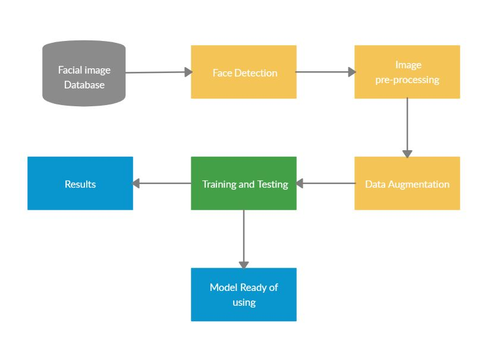
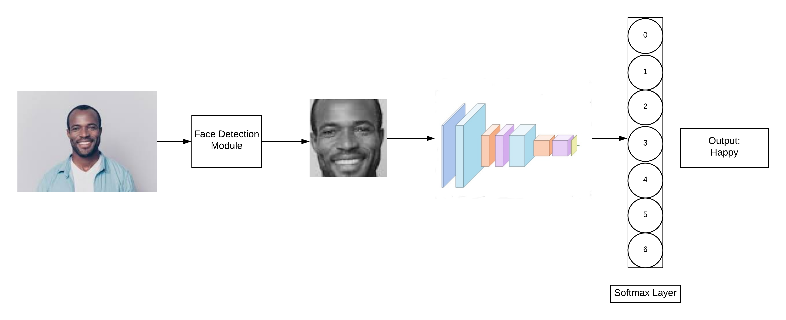
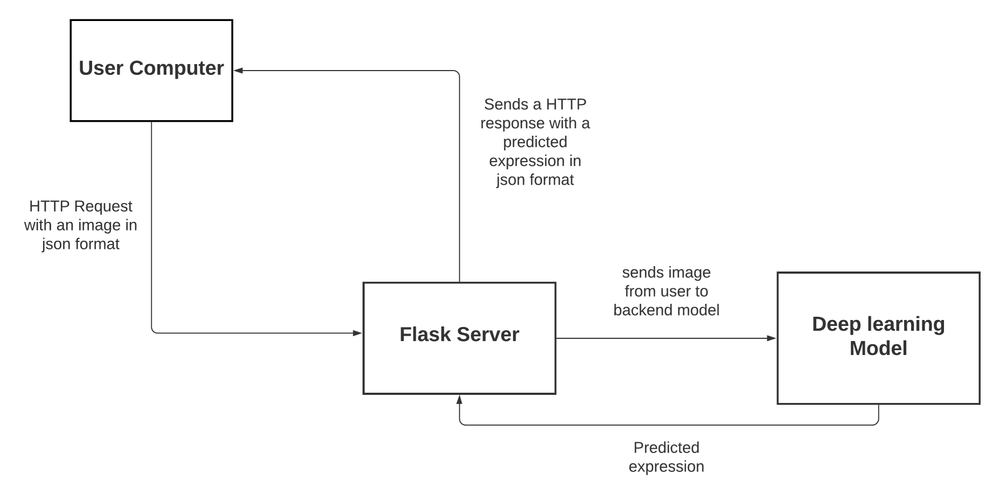

# Facial-Expression-Recognition
To classify the facial expressions on the human face using different architectures of convolutional neural networks.
The categories involved in classification are based on Ekman Model which are:
**Anger, Happiness, Sadness, Surprise, Fear, Disgust and Neutral.**

We used FER2013, KDEF, CK+ and JAFFE datasets to train models.

Below are the results on FER2013 and KDEF 
 

Achieved following results on FER2013 on the best model 

**loss**: 0.7441 - **accuracy**: 0.7314 - **val_loss**: 0.8639 - **val_accuracy**: 0.6893

Achieved following results on KEDF on the best model

**loss**: 0.1239 - **accuracy**: 0.9606 - **val_loss**: 0.4496 - **val_accuracy**: 0.8857

System Architecture

Image Classification

Deployed the best models on a development server using Flask API and created a web page to display the results.

Deployment Architecture

